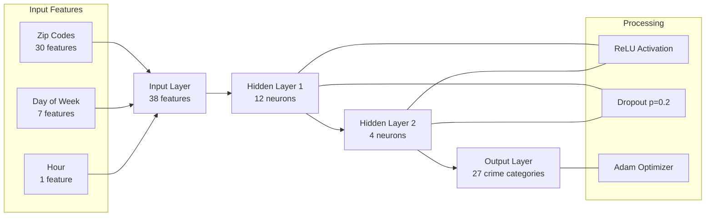
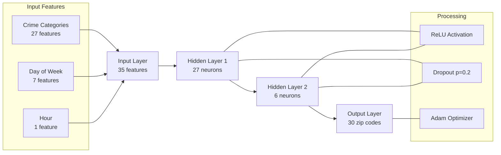

# 🔍 Crime Prediction Using Neural Networks


> A neural network approach to predicting crime types and locations based on historical data from Detroit

## 📑 Table of Contents

- [Introduction](#introduction)
- [Dataset](#dataset)
- [Methodology](#methodology)
- [Models](#models)
- [Model Flow Diagrams](#model-flow-diagrams)
- [Results](#results)
- [How to Run](#how-to-run)
- [References](#references)

## 🔎 Introduction

Welcome to the **Crime-Prediction** project! This repository replicates and extends the research from the paper "Predicting Crime and Other Uses of Neural Networks in Police Decision Making" by Steven Walczak. Using neural networks, we predict crime types and locations based on historical crime data from Detroit. Explore this README to learn about the project's purpose, methodology, models, results, and how to get started with the code!

## 📊 Dataset

The project uses the RMS Crime Incidents dataset from the City of Detroit, spanning 2016 to 2020. It includes details like:

- Date and time of incidents
- Location (zip code)
- Crime type

You can download the dataset here: [ResearchGate](https://www.researchgate.net/publication/354071957_Detroit_Crime_Dataset).

## 🔬 Methodology

Our approach builds on the paper's methodology with slight tweaks:

### Data Preprocessing:

- Extracted key columns: `incident_day_of_week`, `incident_hour_of_day`, `zip_code`, `offense_category`.
- Filtered to include only crime categories with 600+ incidents (27 categories total).
- Balanced the training set by sampling from each category.
- One-hot encoded categorical variables (`zip_code`, `day_of_week`, `crime_category`).
- Kept hour as a numerical feature.

### Model Training:

- Implemented Multi-Layer Perceptrons (MLPs) using PyTorch.
- Applied early stopping to avoid overfitting.

## 🧠 Models

We trained two neural network models:

### Crime Type Prediction Model:

- **Architecture**: Two-hidden-layer MLP (12 nodes, 4 nodes).
- **Input**: 38 features (30 zip codes + 7 days + 1 hour).
- **Output**: 27 crime categories.

### Location Prediction Model:

- **Architecture**: Two-hidden-layer MLP (27 nodes, 6 nodes).
- **Input**: 35 features (27 crime categories + 7 days + 1 hour).
- **Output**: 30 zip codes.

## 📊 Model Flow Diagrams

### Crime Type Prediction Model



### Location Prediction Model



## 📈 Results

Here's how the models performed on the validation set:

| Model | Accuracy |
|-------|----------|
| Crime Type Prediction | ~16.4% |
| Location Prediction (Exact) | ~8.2% |

These results align with the paper's findings, showing the models' potential to predict crime patterns with limited data.

## 🚀 How to Run

Ready to dive in? Follow these steps to run the project locally:

### 1. Clone the Repository:

```bash
git clone https://github.com/WasifSohail5/Crime-Prediction.git
cd Crime-Prediction
```

### 2. Install Dependencies:

```bash
pip install -r requirements.txt
```

### 3. Download the Dataset:

- Get it from [ResearchGate](https://www.researchgate.net/publication/354071957_Detroit_Crime_Dataset).
- Place it in the `data/` folder.

### 4. Run the Code:

- Open `crime_prediction.ipynb` in Jupyter Notebook.
- Execute the cells step-by-step to preprocess data, train models, and see the results.

## 📚 References

1. Walczak, S. (2021). Predicting Crime and Other Uses of Neural Networks in Police Decision Making. Frontiers in Psychology, 12, 587943. [Link](https://doi.org/10.3389/fpsyg.2021.587943)
2. Dataset: RMS Crime Incidents, City of Detroit. [Link](https://data.detroitmi.gov/datasets/rms-crime-incidents/explore)

---

Happy coding! Feel free to contribute or reach out with questions via the GitHub issues page.
